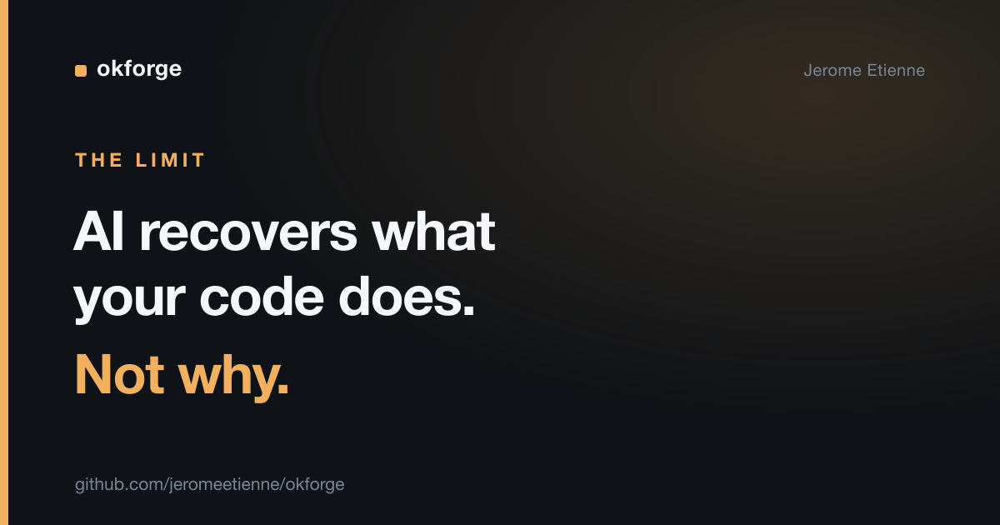

# AI Can Recover What Your Code Does. It Can't Recover Why.

I pointed an AI agent at one of my undocumented projects and asked it to write the documentation. Minutes later, a full, accurate doc set. I tried the same trick on another project and it couldn't meaningfully start.

Same agent. Same prompt. Same author. The difference wasn't the AI. It was what I was asking it to reconstruct.

> The complete project is open source: [github.com/jeromeetienne/okforge](https://github.com/jeromeetienne/okforge)

## The experiment

The first project was [okforge](https://github.com/jeromeetienne/okforge) — a tool with CLI commands, config files, a runtime. Undocumented, but the behavior is all sitting right there in the code. I asked the agent to backfill documentation describing what each part does. It read the source and produced it. Accurate, because the answer was in the source the whole time.

The second project was about Architecture Decision Records — ADRs, short notes that capture *why* a technical decision was made. "We chose Postgres over Mongo because we needed transactions." That kind of thing.

I asked the agent to backfill those the same way. It couldn't. Not because it was worse at the task — because the information genuinely wasn't there to recover.

## What's latent and what's lost

Here's the distinction that took me a real experiment to see clearly.

**What** your code does is *latent*. It's fully determined by the source. A function's behavior, a command's flags, a schema's shape — all of it can be read back out of the code by anything that can read code. An AI agent reconstructs it because it was never actually gone.

**Why** you did it is *lost*. The reasoning that led to a decision leaves almost no trace in the artifact. The code shows you chose Postgres. It does not show you considered Mongo and rejected it, or what constraint forced your hand. Once that reasoning is out of your head and not written down, it is gone — and no amount of model capability brings it back, because there's nothing to read it back from.

People assume the commit history saves them here. It mostly doesn't. Commit messages record what changed, rarely the alternatives weighed or the constraint that decided it. The "why" was in a Slack thread, or a meeting, or just your memory. All three evaporate.

## The turn

We're in a moment where it's tempting to defer everything to "the AI will document it later." For a large class of knowledge, that's true — and freeing. You don't need to hand-write a description of what every command does. The agent will read the code and tell you.

But that very capability draws a sharp line around the thing AI *can't* do for you. It can recover structure. It cannot recover intent. So the documentation worth writing by hand, today, is exactly the part that isn't in the code: the decisions, the rejected options, the reason this looks the way it does.

That inverts the usual advice. Don't spend your effort describing what the code does — the machine will do that on demand. Spend it capturing why, because you are the only source that exists, and you are a source with a short retention window.

## Takeaway

AI reconstructs what your system does, not why you built it that way. Let the agent backfill the "what." Write down the "why" now, while you still have it — it's the one thing that can't be recovered later.

I help teams figure out which knowledge to capture by hand and which to let agents generate. If you're drowning in docs that AI could have written for you — and missing the few that only you can — reach out.
