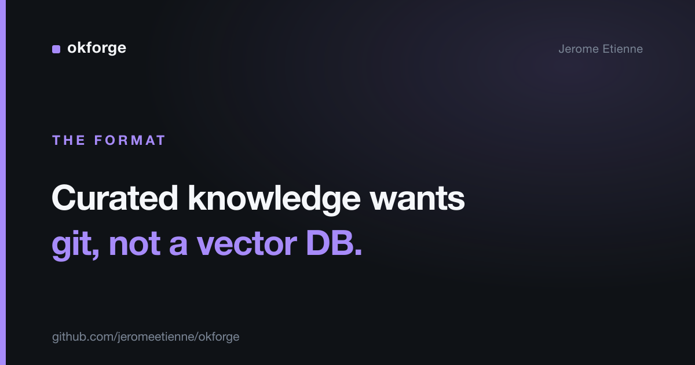

# Your Agent's Knowledge Base Is Probably Overengineered

Before you stand up a vector database to give your AI agent knowledge about your own system, try a folder of markdown files in git.

The reflex right now is automatic. Agent needs context, so you reach for embeddings, a vector store, a retrieval pipeline. For a lot of curated, authored knowledge, that's a heavy machine bolted onto a problem git already solved.

> The complete project is open source: [github.com/jeromeetienne/okforge](https://github.com/jeromeetienne/okforge)

## What the heavy setup actually costs

A vector pipeline isn't free. You chunk your content, embed it, store the vectors, run a similarity search at query time, and hope the right chunk surfaces. When the answer is wrong, you debug a black box: was it the chunking, the embedding model, the similarity threshold, the re-ranker?

You also lose the things plain files give you for free. You can't `cat` a vector. You can't `git blame` a chunk to see when a fact changed and who changed it. You can't open a pull request against an embedding. The knowledge stops being legible the moment it goes in.

For a corpus of millions of documents you can't curate, that trade is worth it. For the few dozen pages that describe your own system, it usually isn't.

## The lighter setup

For knowledge about your own system — the stuff you'd actually curate — a directory of markdown files does the job, and it's readable by both humans and agents without any infrastructure.

That's what I used for [okforge](https://github.com/jeromeetienne/okforge). The knowledge lives in plain markdown, each file carrying a small metadata header, organized in folders. It follows Google's Open Knowledge Format, an open spec for exactly this: human- and agent-friendly knowledge as files you can read with your eyes.

What you get from that choice:

- **It's legible.** `cat` a file and you've read it. No tooling between you and the content.
- **It ships with the code.** `git clone` the repo and the knowledge comes with it, versioned in lockstep with the source it describes.
- **It has history for free.** `git log` and `git blame` already tell you when a fact changed and why.
- **Agents read it directly.** No retrieval step to get wrong. The agent opens the file, same as you.

And because it's curated rather than dumped, the agent isn't fishing for the right chunk in a sea of embeddings. The structure *is* the index.

## The honest scope

This is not "RAG is dead." If you're searching a million support tickets or the entire public web, you need retrieval and embeddings, full stop. That problem is real and vectors are the right tool.

The point is narrower and, I think, more useful: most teams reach for that machine when their actual problem is fifty curated pages about their own system. For that problem, retrieval is overkill. You don't need to *find* the relevant knowledge in a haystack — you authored it, you know where it goes, and a folder structure says so directly.

Match the tool to the knowledge. Uncurated and enormous wants retrieval. Curated and yours wants files.

## The turn

The interesting shift isn't technical, it's about who the docs are for. We used to write documentation for humans and build separate machinery to feed context to machines.

A plain-markdown knowledge bundle collapses that into one artifact. The same files a developer reads are the files the agent reads. You maintain one source of truth, in git, legible to everyone — carbon and silicon. The second brain Karpathy talked about doesn't have to be a database. It can be a repo.

## Takeaway

Don't reach for a vector store by reflex. For curated knowledge about your own system, plain markdown in git is readable, versioned, and agent-ready with zero infrastructure. Save the retrieval pipeline for the haystack you can't curate.

I help teams pick the right altitude for their AI tooling — and skip the infrastructure they don't need. If you're standing up a vector DB and aren't sure you should, reach out.
