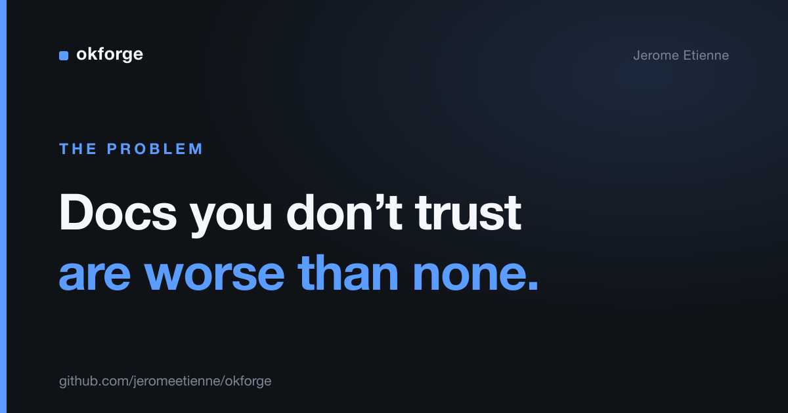

# The Most Dangerous Documentation Is the Kind You Don't Trust

I didn't trust my own documentation. That is a worse problem than having none.

When you have no docs, you know it. You go read the code. When you have docs you don't trust, you read them, hesitate, and then go read the code anyway — so you paid the writing cost twice and got nothing back.

That was my repos for years. The docs were always a little behind. A renamed function here, a deleted flag there. Nothing dramatic. But enough that I could never be sure a page was current, and "never sure" rounds down to "ignore."

> The complete project is open source: [github.com/jeromeetienne/okforge](https://github.com/jeromeetienne/okforge)

## Why this is worse now

It used to be only humans read your docs, and humans are forgiving. We cross-check, we assume the README is six months stale, we go ask the person who wrote it.

Agents don't. When an AI coding agent reads your documentation, it treats it as ground truth and acts on it. A stale doc isn't a minor annoyance anymore — it's wrong context fed straight into something that writes code for you.

So the cost of drift went up at exactly the moment everyone started pointing models at their repos.

## Trust is binary, and that's the trap

Here's the part I had wrong for years. I kept trying to make my docs *more complete*. More pages, more detail.

That's solving the wrong variable. The problem was never coverage. It was that I couldn't tell, at a glance, which pages were fresh and which had drifted. And trust doesn't degrade gracefully — one page you know is stale poisons your confidence in all the others. You stop trusting the set.

You don't fix that by writing more. You fix it by making freshness something you can *see*.

## Treat docs as a derived artifact

So I stopped treating documentation as prose I maintain by willpower, and started treating it as an artifact derived from source — the same way a compiled binary is derived from code.

The move is simple: write down which docs are generated from which source files. Once that mapping exists, drift becomes computable. When a source file changes and its doc doesn't, the system can tell you. The doc is flagged stale, automatically, the moment the thing it describes moves.

I built a small tool around this idea called [okforge](https://github.com/jeromeetienne/okforge) — two days of work, solo, now on npm. It keeps a folder of markdown docs mapped to the source they describe, and it can answer one question I could never answer before: *which of these pages can I still trust?*

That question is the whole game. Not "are the docs complete," but "do I know which ones are current." The first is endless. The second is a yes or no.

## The turn

I went in thinking the deliverable was better documentation. It wasn't. The deliverable was *trustworthy* documentation — and those are different products.

Better docs help you when you read them. Trustworthy docs change whether you read them at all. Once freshness is visible, the docs stop being a thing you maintain out of guilt and start being a thing you actually open.

## Takeaway

If you don't trust your docs, writing more won't fix it. Make staleness visible — map docs to source so drift is something the machine flags, not something you hope you'll remember to check.

I build small AI tools that fix exactly this kind of papercut. If that is useful to your team, reach out.
