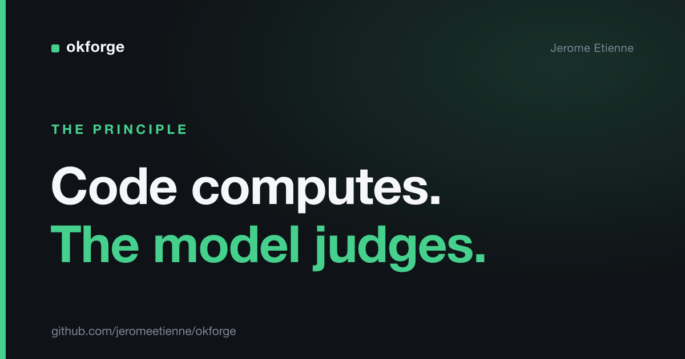

# Don't Ask a Model What Code Can Compute

Everyone is handing whole workflows to an LLM. Most of those steps shouldn't touch a model at all.

I see it constantly: a pipeline where every stage is a prompt. Parse this, validate that, check the format, decide if it's done. All of it routed through a model, all of it occasionally wrong in ways nobody can predict.

There's a cleaner line to draw. **Code computes, the model judges.** And once you draw it, your AI systems get more reliable and cheaper at the same time.

> The complete project is open source: [github.com/jeromeetienne/okforge](https://github.com/jeromeetienne/okforge)

## The split, concretely

I built a documentation tool called [okforge](https://github.com/jeromeetienne/okforge) — two days, solo, on npm. It keeps a folder of markdown docs in sync with the source code they describe. Plenty of room to overuse a model. I did the opposite.

The model does exactly one thing: write the prose. Explain what this CLI command does, summarize what this subsystem is for. That's judgment. There's no single correct paragraph, and a human couldn't write a rule that produces it. Perfect job for an LLM.

Everything else is code:

- Are the internal links valid, or do they point at files that don't exist? Code checks that.
- Are the file names in the required naming convention? Code checks that.
- Does every concept doc carry the required metadata header? Code checks that.
- Which docs drifted because their source changed? Code computes that from the file mapping.

None of those have an opinion. They have a *correct answer*. So a model should never be the thing deciding them.

## "But you can test an LLM"

When I first wrote this principle down, I phrased it as "if you can test it, don't leave it to the LLM." A friend pushed back, correctly: you *can* test an LLM. That's what evals are. Testability isn't the line.

The line is **determinism**. Is there a single correct answer that a function can produce? Then write the function. If the answer is a judgment call with no computable "right," that's when you reach for the model.

Link validity is deterministic — a link either resolves or it doesn't. Prose quality is not. That distinction, not testability, is where you cut.

## Why this matters to anyone shipping AI

Three things fall out of drawing the line in the right place.

**Reliability.** The deterministic parts can't hallucinate. A link checker is correct every time. The moment you let a model "verify" something a function could verify, you've added a failure mode for no reason.

**Cost and speed.** Every check you move from a prompt to a function is a token bill and a round-trip you stop paying. In a loop that runs constantly, that adds up fast.

**Debuggability.** When code computes the answer, a wrong answer has a stack trace. When a model computes it, you get to re-read your prompt and guess.

## The turn

The instinct with a capable model is to give it more. More responsibility, more of the pipeline, more "let the AI handle it."

The senior move is to give it *less* — to keep the model on the one job nothing else can do, and to push everything with a knowable answer into plain code. A good AI system is mostly not-AI, wrapped tightly around the small core that genuinely needs a model.

The tool I built reflects this in its own architecture. The model writes; the code verifies. Neither does the other's job.

## Takeaway

Before you put a step in a prompt, ask one question: could a function compute this answer? If yes, write the function. Don't ask a model what code can compute.

I design AI workflows around exactly this line — keeping models where they earn their keep and out of everywhere they don't. If your team is wiring up agents and the reliability isn't there, that's usually the reason. Reach out if that's useful.
