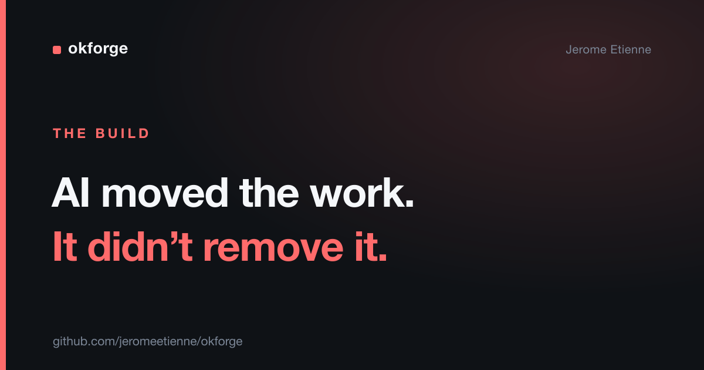

# I Shipped a Dev Tool in Two Days. The Code Was the Easy Part.

AI wrote most of [okforge](https://github.com/jeromeetienne/okforge)'s code. My job was deciding what not to let it write.

[okforge](https://github.com/jeromeetienne/okforge) is a small tool that keeps a repo's documentation in sync with its source. I built it solo over a weekend — two days, start to published on npm, around 1,200 lines of TypeScript. The typing was fast, because I wasn't really the one typing. The model was.

That sounds like the headline. It isn't. The headline is what I spent the two days actually doing, because it wasn't writing code.

> The complete project is open source: [github.com/jeromeetienne/okforge](https://github.com/jeromeetienne/okforge)

## What the two days were spent on

If the model writes the code, the work moves up a level. My time went into decisions, not keystrokes:

- What is this tool's one job, and what is explicitly not its job.
- Where is the line between what the model decides and what the code decides.
- Which behaviors have a single correct answer, and therefore must be deterministic.

That last one was most of it. [okforge](https://github.com/jeromeetienne/okforge) documents your code, and a model writes the documentation prose — because there's no single correct paragraph, so that's genuine judgment. But everything checkable runs in plain code: whether links resolve, whether names follow the convention, whether each doc carries its required header, which docs went stale because their source moved.

I wasn't writing those checks line by line. I was deciding they should *be* checks — code with a knowable answer — instead of one more thing I ask a model to eyeball. The principle did the heavy lifting: don't ask a model what code can compute.

## The details that take the judgment, not the typing

A few choices that cost thinking and almost no code:

**A reminder that nudges, but never nags.** The tool can notice your docs have drifted and remind you. The hard part wasn't detecting drift — that's a deterministic check. It was deciding the reminder fires at most once per session, stays out of your way when you're already editing docs, and never blocks anything. Restraint is a design decision, not a line of code.

**Ship the instructions, not just the binary.** The part that tells the AI how to maintain a bundle travels with the tool and gets installed into your project, so updates arrive without you hand-editing anything. Deciding that shape mattered more than implementing it.

**One engine, two faces.** The same code that answers questions on the command line also powers a little static-site browser for the docs. Reusing one engine instead of two was a call about consistency, made once, up front.

None of these are much code. All of them are the actual work.

## The turn

The story everyone wants is "AI wrote my app in a weekend." The truer and more useful story is that AI moved the work, it didn't remove it.

When the model handles the typing, your value isn't typing faster. It's judgment — knowing what to build, what to leave out, and which parts must be deterministic so the whole thing can be trusted. The tool I shipped is small precisely because most of the two days went into deciding what *not* to put in it.

That's the shape of senior engineering now. Less producing code, more deciding what's code's job and what's the model's. The work didn't get easier. It got more leveraged.

## Takeaway

Shipping fast with AI isn't about the model writing more code. It's about you making sharper decisions about where the model belongs and where it doesn't. The code was the easy part — the decisions were the work, and the decisions are still yours.

This is how I build: fast, small, and clear about where AI earns its place. If your team wants to ship like this, reach out.
