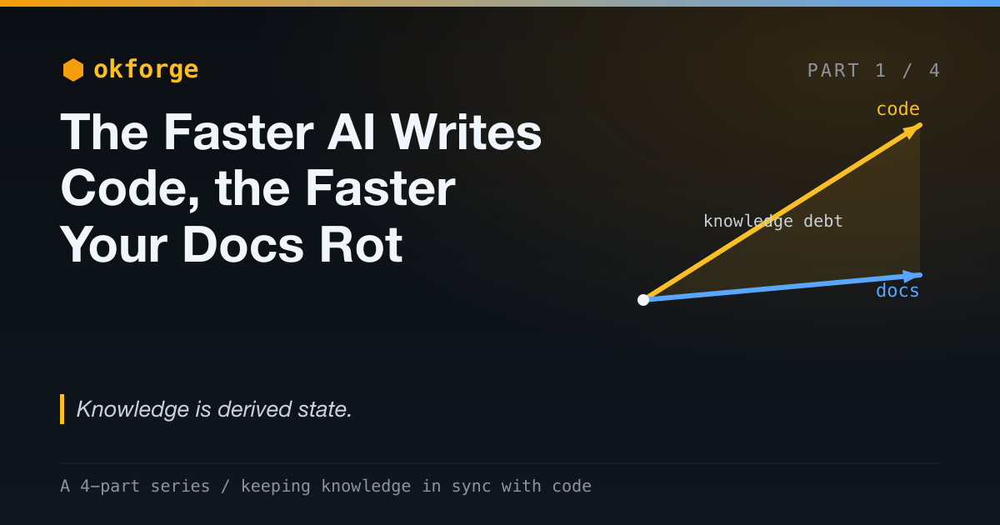

# okforge: The Faster AI Writes Code, the Faster Your Docs Rot

*AI agents made writing code almost free. That's exactly why your documentation is rotting faster than ever — and why "just write better docs" was always the wrong answer.*

*Part 1 of a 4-part series on okforge and keeping knowledge in sync with code.*

---

AI agents made writing code almost free. That should have been good news for documentation, too: point the same agent at the codebase, ask it to write the docs, done.

It wasn't. The faster I shipped code, the faster the docs fell behind — and not by a little. I'd describe a module on Monday and the description was a polite fiction by Friday, because the module had moved three times and the prose hadn't moved at all.

I tried everything. READMEs. Doc comments. A real docs site. Notes in a wiki. Every one of them drifted, usually within a couple of weeks of real work. I've stopped believing this is a discipline failure — mine or anyone's. It's structural. And AI coding turned a slow structural leak into a flood.

> The complete project is open source: [github.com/jeromeetienne/okforge](https://github.com/jeromeetienne/okforge)



## "Just Write Better Docs" Is the Wrong Answer

The standard advice when docs go stale is some flavor of *try harder*: make docs part of the Definition of Done, add a checklist item, be more disciplined.

That advice quietly assumes documentation is something you author once and then maintain by willpower. It isn't. Documentation is a **derived artifact** — it's downstream of the source code, the same way a compiled binary, a cache, or a generated API client is downstream of its inputs. The instant the source changes, the derived thing is stale. Not because anyone was lazy. Because nobody recomputed the derivative.

You already know this everywhere else in your stack. You don't hand-edit compiled output and then blame yourself when it drifts from the source — you regenerate it. You don't keep a cache fresh through conscientiousness — you invalidate it when its inputs change. Documentation is the one derived artifact we still pretend is hand-written prose, maintained by virtue. That pretense is the bug.

## Why AI Makes the Derivative Diverge Faster

If docs are downstream of source, then anything that makes source move faster makes docs rot faster. AI agents make source move *much* faster, in three compounding ways.

**Volume.** An agent writes more code per hour than you do. More surface area, more to keep an accurate account of, produced faster than any human can describe it.

**Velocity.** Refactors that used to cost a day cost minutes. The source doesn't just grow; it *churns* — the shape of the thing you documented last week is simply gone.

**A new, unforgiving reader.** This is the one people miss. Agents don't just write the code now — they *read the docs*, too. A stale doc used to cost you a confused new hire, eventually. Now it costs you a confused *agent*, immediately — and that agent bakes its misunderstanding into the next few hundred lines before you've had your coffee. Drift used to be a slow tax on humans. It's now a fast tax on machines, paid at machine speed.

Underneath all three is one asymmetry: **generating code got dramatically cheaper; understanding it didn't.** The gap between how much code exists and how much of it anyone — or any agent — actually understands is real, and it deserves a name: *knowledge debt*. By that measure, an AI coding agent is a knowledge-debt machine. It's superb at producing the asset and does nothing, by default, for the understanding that's supposed to travel with it.

## The Knowledge That Evaporates First

Not all knowledge is equal, and AI erodes the most valuable kind fastest.

Some knowledge is **descriptive**: what this module does, what arguments this command takes. It's annoying when it's stale, but you can recover it by reading the code.

The expensive kind is the **why** — the invariants and cross-cutting rules that aren't written in any single file. Things like: *this system never merges and never closes issues.* *Every fix happens in an isolated worktree.* *No two open pull requests may touch the same file.* You can't recover those by reading one function; they're the load-bearing context that lives in one person's head and walks out the door when they do. Agents need that context most and have access to it least — so they violate it confidently, at scale.

That's the knowledge worth capturing. And it's exactly the knowledge no codebase documents about itself.

## "Can't the Agent Just Update the Docs Too?"

This is the first thing every engineer says, and it's the right instinct — automate the derivative. But naively bolting "also update the docs" onto your coding agent fails in three specific ways, and the failures are instructive:

- **It doesn't know what's affected.** The agent just changed `auth.ts`; which of your forty docs describe behavior that depends on it? With no declared map from source to docs, the agent is guessing — and it guesses conservatively, touching the doc next to its diff and missing the three downstream ones.
- **It writes from memory, not from the source.** Ask a model to "update the docs" after a change and it documents the change it *remembers* making, against a mental model of the rest of the system that may be months stale or simply wrong. That's how you get documentation that reads as authoritative and is quietly wrong.
- **It rewrites what didn't change.** Turned loose, the agent happily reformats and "improves" docs whose source never moved, churning your diff and quietly seeding errors into the parts that were fine.

None of these are model-quality problems that the next, smarter model fixes. They're *system-design* problems: a missing source-to-doc map, a missing grounding discipline, a missing boundary around what the model is allowed to touch. Which is exactly what the reframe is about.

## The Reframe: Treat Knowledge as Derived State

Here's the shift that changed how I think about this. Stop hand-maintaining docs. Treat the knowledge around a system the way you treat any other derived artifact, and ask the same engineering questions you'd ask of a build step:

1. **What is each piece of knowledge derived from?** If you can't name the source, you can't know when it's stale. "Is this doc out of date?" should be a computable question, not a feeling.
2. **How do we regenerate it faithfully?** From the *real* source, read fresh — not from a model's fuzzy memory of how the code probably works.
3. **How do we keep the model on a leash?** Let it do the one part that genuinely needs judgment — the prose — and keep all the bookkeeping deterministic and checkable.
4. **How does it survive us?** In a format cheap enough to read and diff that it stays readable without the tool, with a nudge when reality drifts away from the docs.

Answer those four and documentation stops being a moral failing and becomes a pipeline. That's the whole reframe.

## What It Looks Like in Practice

That reframe is why I built **okforge** — a small Claude Code skill plus a CLI that maintains an [Open Knowledge Format](https://github.com/GoogleCloudPlatform/knowledge-catalog/blob/main/okf/SPEC.md) bundle: a folder of plain markdown, living in the repo, describing the system.

The trick fits in one file. On another project of mine — `issue_autofix`, a Claude Code plugin — the entire source-to-knowledge mapping is this:

```json
{
  "folders": {
    "slash_commands": ["commands/"],
    "cli": ["src/"],
    "concepts": ["README.md", "commands/"],
    "packaging": ["package.json", ".claude-plugin/"]
  }
}
```

That's knowledge debt made computable. Change something under `commands/` and leave the docs untouched, and the system *knows* the `slash_commands` knowledge is now stale — because the derivation is written down, not assumed. No discipline required; the staleness is a fact you can query.

And the expensive "why" finally gets a home. That repo's `concepts/` folder holds documents like `never_merge`, `conflict_free_invariant`, and `worktree_isolation` — the invariants that don't live in any single source file, captured as first-class knowledge instead of folklore.

I'll go deep on how all of this works — and, more importantly, *why it's built the way it is* — across the rest of this series. The point of this post isn't the tool. It's the reframe.

## The Thesis

Knowledge is derived state. Once you accept that, the documentation problem changes shape entirely. You stop asking people to care more and start asking your system three engineering questions: what is each doc derived from, how do we regenerate it faithfully, and how do we know when it's stale.

The rest of this series is how I answered them — and the answers turn out to be less about documentation than about building reliable systems on top of unreliable models:

- **okforge: Give the Model Less** — hand the LLM the smallest job only it can do, and keep everything else deterministic and checkable.
- **okforge: Don't Make It Remember, Make It Read** — grounding, and why hallucination is a design failure, not a model failure.
- **okforge: Bet on Boring Formats** — why I shipped plain markdown, an open spec, and an installable skill instead of a clever app.

AI didn't break documentation. It just made the cost of pretending docs are hand-written prose too high to keep ignoring.
