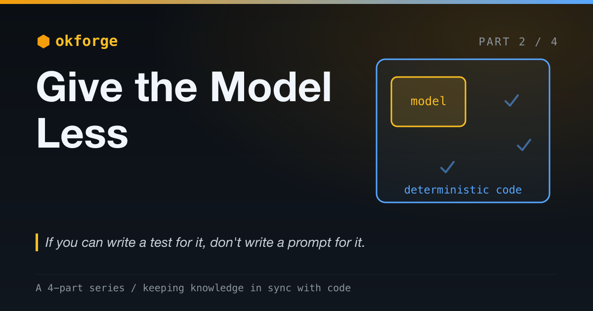

# okforge: Give the Model Less

*The most reliable AI systems hand the LLM the smallest possible job — and make everything around it checkable.*

*Part 2 of a 4-part series on okforge and keeping knowledge in sync with code. (See [Part 1](post-1-the-faster-ai-writes-code-the-faster-your-docs-rot.md).)*

---

The reflex in AI engineering right now is to give the model *more*. More tools. More autonomy. More of the loop — let the agent plan, decide, act, and check its own work. The word for it is "agentic," and it's usually said with enthusiasm.

For reliability, it's backwards. The most reliable AI systems I've built give the model *less*. They hand it the smallest job that genuinely requires a model, wrap that job in deterministic code, and refuse to let it anywhere near anything that has a right answer.

That's the design philosophy behind okforge, and this post is about why.

> The complete project is open source: [github.com/jeromeetienne/okforge](https://github.com/jeromeetienne/okforge)



## Why We Over-Use the Model

The model is seductive because it *kind of* does everything. Ask it which docs are stale and it'll produce something plausible. Ask it to follow a file format and it mostly will. Ask it to plan a multi-step task and it'll give you steps. It never says "that's not my job."

But "kind of does everything" is a description of an unreliable system. The model is the most expensive component in your stack, the slowest, and the least predictable — the only one that can give two different answers to the same question. You would never deliberately build the rest of your architecture out of your most expensive, slowest, least predictable part. Yet that's exactly what "let the agent handle it" does: it puts the model in the critical path for work that has a correct answer and never needed a model at all.

The discipline is to notice when you're reaching for the model out of convenience rather than necessity — and to stop.

## The Rule

Here's the line I draw:

> If a step has a verifiable right answer, it belongs in deterministic code. If it's an irreducible judgment call over fuzzy, natural-language input, it belongs to the model.

Or, more bluntly: **if you can write a test for it, don't write a prompt for it.**

A test implies a right answer. A right answer implies you don't need — and don't want — a probabilistic component computing it. Every step you move to the code side of that line gets cheaper, faster, and *correct by construction* instead of correct-most-of-the-time.

## okforge Has Exactly One Fuzzy Job

okforge maintains a knowledge bundle — a folder of markdown describing a codebase — and keeps it in sync as the code changes. (Part 1 made the case for why that matters: knowledge is derived state, and AI coding makes it rot fast.)

Look at everything that involves, and notice how little of it actually needs a model:

| Job | Has a right answer? | Who does it |
|---|---|---|
| What is each doc folder derived from? | Yes — it's declared | Code |
| Did any of that source change since HEAD? | Yes — it's a `git diff` | Code |
| Is the bundle well-formed (names, frontmatter, links)? | Yes — it's a lint | Code |
| Turn these source files into prose that explains them | **No** — it's judgment | Model |

Three of the four have a single correct answer. Only the last — turning a pile of source files into prose that explains what they *mean* — is irreducibly fuzzy. So that's the only thing okforge lets the model do. Everything else is a few hundred lines of boring TypeScript.

The deterministic side answers exactly two questions, over and over: **"what is each folder derived from?"** and **"is the bundle still well-formed?"** Neither needs a model. Both would be *less* reliable with one.

## Two Places I Refused to Use the Model

A design is often defined by what you *don't* hand the LLM. Two okforge decisions are worth showing.

**1. What counts as stale.**

The core job is knowing when a doc has drifted from its source. It's tempting to ask the model: "here's the doc, here's the code — is the doc out of date?" It would even mostly work.

okforge doesn't do that. The source-to-doc mapping is declared in a config file, and staleness is a `git diff`:

```json
{
  "folders": {
    "slash_commands": ["commands/"],
    "cli": ["src/"],
    "concepts": ["README.md", "commands/"],
    "packaging": ["package.json", ".claude-plugin/"]
  }
}
```

Changed a file under `commands/` and didn't touch the `slash_commands` docs? That folder is stale. It's a set-membership check against the filenames `git` already hands you — exact, instant, free, and *the same answer every time*. A model-based staleness check is none of those: it costs tokens, adds latency, and is occasionally wrong — and "occasionally wrong about what's stale" silently corrupts the entire premise of the tool. The one thing a sync tool cannot do is be unsure whether things are in sync.

So the model never decides what's stale. It writes prose only, and only after the deterministic side has told it *which* folder to rewrite.

**2. Whether the output is valid.**

OKF has format rules: snake_case filenames, a non-empty `type` in every concept doc's frontmatter, no frontmatter in sub-folder index files, every internal link resolving. You could put those in the prompt and trust the model to follow them. Models follow instructions — until they drift, and they always eventually drift.

Instead the rules live in a `check` command — a linter. If the model forgets a `type` or emits a dangling link, `check` fails with the exact file and problem, and the bad output never lands. The format isn't a request I make of the model; it's an invariant the code enforces.

Notice the shared pattern: the model proposes, deterministic code disposes. The model is never the last word on anything that has a right answer.

## What the Model Is *For*

This isn't model skepticism. There's one thing in okforge that code genuinely cannot do: read a handful of source files and write a paragraph that accurately captures what they mean and why they matter. That's synthesis and judgment over natural language — exactly what the model is uniquely, almost magically good at. So that's its job, and I defend that job fiercely. (Even there I don't fully trust it: the prose is grounded in real source and reviewed before it commits — but that's the next post.)

The goal was never to use the model less because models are weak. It's to use the model *only* where its unique capability is irreplaceable, so everything else can be reliable.

## What a Small Model Surface Buys You

Shrinking the model's job to one well-fenced task pays off four ways:

- **Reliability.** The checkable parts can't hallucinate. `check` either passes or hands you an exact list of problems. `stale` is a fact about your git history, not an opinion. The parts with a right answer are always right.
- **Auditability.** You can read the entire implementation and know *exactly* what the system does. You cannot read a prompt and know what it will do — only what it'll probably do most of the time. Most of the system being readable code is most of the system being trustworthy.
- **Cost and latency.** Deterministic operations are instant and free. okforge doesn't spend a token computing what `git diff` computes. The model runs once, for the one thing it's there for.
- **Containment.** When the model's only job is prose, its failures are *contained to prose* — which a human reviews before it commits. A model failure can't corrupt the staleness logic or the conformance check, because the model isn't anywhere near them. You've shrunk the blast radius to the one place you were already watching.

That last point is the prize. You can't stop a model from occasionally being wrong. You *can* decide how much of your system is downstream of it being right.

## The Method, for Any AI Feature

okforge is a small example, but the method generalizes to anything built on a model:

1. **Enumerate every step** the feature performs. Be granular.
2. **Classify each step.** Verifiable right answer → code. Irreducible judgment over fuzzy input → model.
3. **Push the line toward code** as far as it will go. Most steps people hand the model have a right answer hiding inside them.
4. **Wrap the model in deterministic checks** so its output is verified and its failures are caught before they propagate.
5. The result: the model is a **small, fenced component**, not the system.

The hard part isn't the method; it's the restraint. The model will happily take any job you give it, and demos reward giving it more. Production rewards the opposite.

## Give the Model Less

"Agentic" maximalism — hand the model the whole loop and let it figure things out — optimizes for the demo, where breadth looks like power. Reliability optimizes for the opposite: the model touches as little as possible, and everything it does touch is checked by something that can't hallucinate.

In okforge, that deterministic scaffolding is also what makes the series' through-line *true* instead of aspirational. "Knowledge is derived state" only means something if code computes the derivation and verifies the result. The model just fills the one gap nothing else can fill — and not one inch more.

Give the model less. It's the most reliable thing you can do with it.
