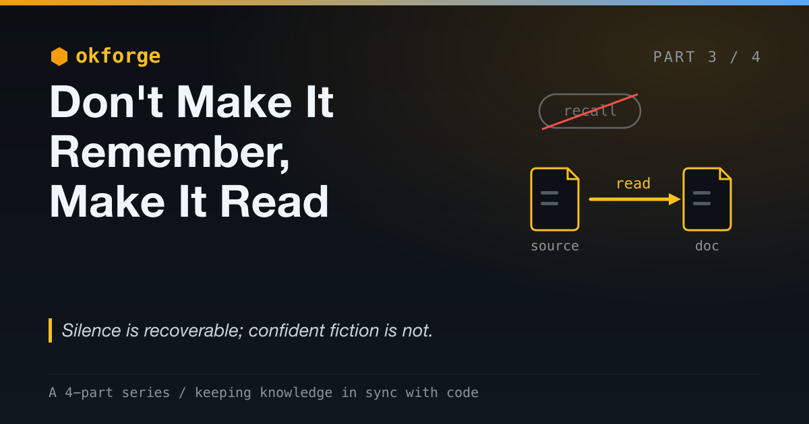

# okforge: Don't Make It Remember, Make It Read

*Hallucination is a design failure, not a model failure.*

*Part 3 of a 4-part series on okforge and keeping knowledge in sync with code. (See [Part 2](post-2-give-the-model-less.md).)*

---

The most dangerous thing a language model does isn't refuse. It's answer confidently from memory.

Ask a model what your `auth.ts` does and it will tell you — fluently, in well-organized paragraphs — whether or not it has ever seen the file. The answer is shaped exactly like the truth. It has the right vocabulary, the right structure, the confident tone. And some fraction of the time it is quietly, completely wrong, and nothing in the output tells you which time this is.

That's the trap, and it's the whole reason okforge never asks the model what the code does.

> The complete project is open source: [github.com/jeromeetienne/okforge](https://github.com/jeromeetienne/okforge)



## Recall Is the Wrong Mode

A model doesn't *know* your codebase. It has a strong prior about codebases that look like yours — and when you ask it to recall, it samples from that prior. Sometimes the prior happens to match your actual code. Sometimes it doesn't. The failure is invisible because both cases produce identical-looking prose.

This is worse than a blank. A blank, you'd go check. Fluent-and-wrong sails straight into your docs, your PR, and the next agent's context, wearing the costume of something verified. **Silence is recoverable; confident fiction is not.**

The fix is not a better model. The fix is to never give the model the opportunity to answer from memory.

## Shrinking the Job Wasn't Enough

[Last post](post-2-give-the-model-less.md) I shrank the model's role in okforge to a single task: writing prose. Everything with a right answer — what's stale, what's well-formed — went to deterministic code.

But "write prose about code" is *exactly* where confident-recall hallucination lives. Shrinking the job doesn't make the model honest about the one job it has left. You have to design the job so that doing it dishonestly isn't possible. This post is how.

## Read, Don't Recall

okforge's refresh runs in a fixed order, and the order is the point.

First, the deterministic side decides which folder is stale and runs `sources <folder>` to list the *exact real files* that folder is derived from. Then the model must **read those files**. Only then does it write — and it writes from what it just read, nothing else.

The prompt is never "document the CLI." It's "here are these specific files; write down what they actually say." That one reframing — from *recall* to *transcribe-and-synthesize* — is most of the battle. The model is brilliant but amnesiac: it can read anything and should remember nothing. Treat it that way and a whole class of hallucination simply has no room to occur, because every claim has a file open in front of it.

## No Invention, and the Courage to Say Less

Reading isn't sufficient on its own, because the model still wants to be helpful in the gaps. So okforge's authoring rules are explicit and a little severe:

- Don't invent field names, routes, flags, or states. Quote the real ones.
- If uncertain, **omit**.

That second rule fights the model's deepest reflex, which is to fill every silence with something plausible. okforge would rather ship a doc that says less than a doc that says something false. A doc that omits a detail is merely incomplete; a doc that invents one is a landmine, because someone — human or agent — will act on it. Designing the task to *reward omission* over confident completion is one of the highest-leverage things you can do to a prompt.

## Cite, so Grounding Is Auditable

Every concept doc ends with a `# Citations` section linking the real repo files it was built from. That turns grounding from a promise into something you can check: pick any claim, follow its citation, confirm it against the source.

Here's a real one, from the `never_merge` concept in the `issue_autofix` bundle okforge maintains:

```markdown
# Citations

- [../../commands/issue_autofix.md](../../commands/issue_autofix.md) — `Fixes #<number>` in the pull request body; "Do not close the issue and do not merge the PR".
- [../../commands/issue_autofix_session.md](../../commands/issue_autofix_session.md) — "Nothing is ever merged"; the reject-by-closing note.
- [../../README.md](../../README.md) — "It never merges and never closes issues".
```

Each line pins a claim to its source. The doc's central assertion — *the system never merges and never closes issues* — traces straight to that exact phrase in the README, and the mechanism that enforces it (`Fixes #<number>`) traces to the command that writes it. That's the receipt made literal.

This matters more than it looks. "The model was grounded" is unfalsifiable. A citation that says *this claim lives in `README.md`, go read it* is checkable. Provenance is the difference between *trust me* and *here's my source* — and in a world where agents read these docs too, a citation is a thread the next reader can pull instead of taking the prose on faith.

## Draft-Then-Review, Never Silent

Even grounded and cited, the model never gets the final say. Refresh is a draft-then-review loop: it rewrites the affected docs, you review, then you commit.

The detail that makes the review *real* is restraint: okforge won't touch docs whose source didn't change. Your review surface stays small and honest — just the docs that actually drifted — instead of being buried under cosmetic rewrites of files that were fine. Human-in-the-loop isn't a disclaimer you bolt on at the end; it's a design primitive. And keeping the diff minimal is what makes the human actually look, instead of rubber-stamping a hundred-file churn.

## What Code Can Backstop, and What It Can't

There's a clean line here, and it's worth naming.

No amount of code can verify that a paragraph is *true* — only a human reading the cited source can do that, which is why review is non-negotiable. But code can verify the output is *well-formed and internally consistent*, and that catches a real class of model sloppiness. okforge's `check` confirms every concept doc has its frontmatter, and that every internal link resolves. If the model links to a concept that doesn't exist, the dead-link lint fails and the output never lands.

So the trust stack has two layers: deterministic checks catch the failures that have a right answer (a broken link, a missing type), and human review catches the one that doesn't (is this actually correct?). The model proposes grounded prose; code verifies its form; a person verifies its truth. Nothing is taken on the model's word alone.

## A Grounding Checklist You Can Steal

None of this is specific to documentation. The same five rules apply to any model-powered feature:

1. **Read, then write.** Pull the real, current source into context. Never rely on training memory for a fact you can look up.
2. **Constrain to the provided context.** Tell the model to answer only from what you gave it. This is the honest core of "RAG," minus the acronym.
3. **Cite.** Make it attribute claims to sources, so the output is auditable rather than merely confident.
4. **Fail closed.** Design the prompt and the output gate to prefer "I don't have that" over a plausible guess. Reward omission.
5. **Review a minimal diff.** Keep a human in the loop, and keep the change small enough that the review is real.

Do these and you'll find the model's hallucination rate on your task collapses — not because the model changed, but because you stopped asking it to make things up.

## A Design Failure, Not a Model Failure

Which is the whole point. "Models hallucinate" is true and useless. It frames the problem as a property of the weights, something you wait for a vendor to fix in the next release.

For a *bounded* task, you control the two things that decide whether the model invents: what goes into its context, and what's allowed out. Feed it the real source, gate the output, reward omission, and review the result — hallucination on that task drops toward zero with the models we already have. If your feature still makes things up, the bug is upstream of the model. It's in the pipeline you built around it.

So the honest version of "my feature hallucinates" is: *I let the model answer from memory, and I didn't gate the output.* That sentence is uncomfortable, but it's the productive one — because every clause in it names something you can change.

You can't build a model that never makes things up. You can build a system that never gives it the chance. Don't make it remember. Make it read. Trust is constructed.
