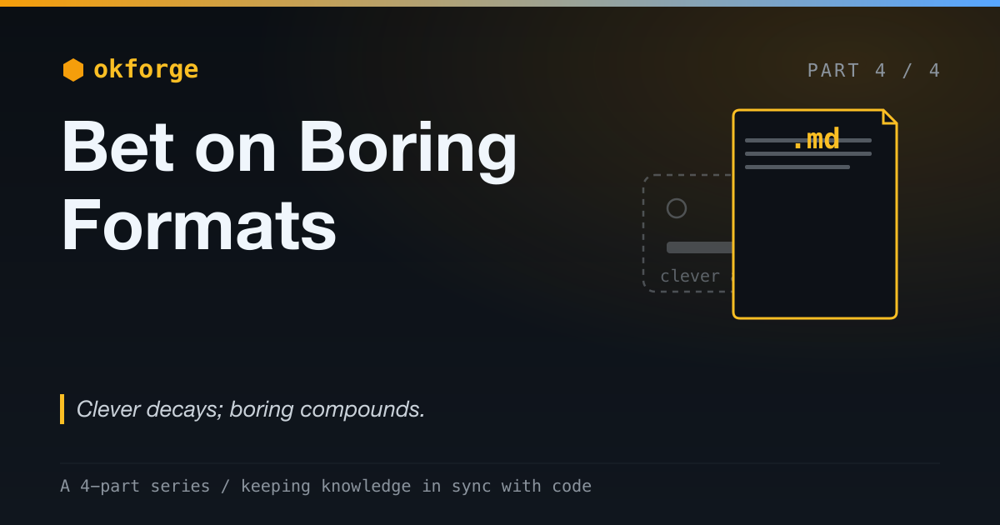

# okforge: Bet on Boring Formats

*Why I shipped plain markdown, an open spec, and an installable skill instead of a clever app.*

*Part 4 of a 4-part series on okforge and keeping knowledge in sync with code. (See [Part 3](post-3-dont-make-it-remember-make-it-read.md).)*

---

okforge could have been a clever app. A web dashboard for your knowledge. A database with a nice query layer. Accounts, sync, an "AI-powered knowledge platform" with a logo and a pricing page.

It's none of that. It's plain markdown files sitting in your repo, an open format it didn't invent, and a one-command install. Every one of those was a deliberate decision to be *boring*. This post is why boring wins — and why, for anything whose job is to last, it's not even close.

> The complete project is open source: [github.com/jeromeetienne/okforge](https://github.com/jeromeetienne/okforge)



## The Clever Path, and Why I Didn't Take It

The clever version writes itself. Pull your codebase into a service, build a knowledge graph, put a slick UI on top, add a chat box. It's impressive, and it's the kind of thing you can raise money on.

And it's the wrong architecture for this problem, because the job here is to make knowledge *last* — and the clever path makes your knowledge depend on the tool. The moment your knowledge lives in someone's database behind someone's API, it lives exactly as long as that company, that API, and your paid subscription do. You've taken the one asset that's supposed to outlive everything and made it the most fragile thing you own.

So I asked one question of every design decision: **would this knowledge survive the death of the tool?** Boring is just what's left when the answer has to be yes.

## Boring Formats Win on Durability

OKF is plain markdown with a little YAML frontmatter. The whole spec fits in your head. If you can `cat` a file you can read it; if you can `git clone` a repo you can ship it.

That sounds unglamorous until you notice what it buys: if okforge vanished tomorrow, your bundle is still just markdown. You can `grep` it, `git diff` it, read it in any editor, feed it to any model. The knowledge outlives the tool that wrote it, because nothing about reading it requires the tool. There's no export step, because there's nothing to export *from* — it was never captured in the first place. **Clever decays; boring compounds.**

This is the test I'd apply to any knowledge tool you're evaluating: turn the tool off and see what you're left with. With a database-backed app, you're left with a support ticket. With markdown in git, you're left with everything.

## In the Repo, Not in a Service

The bundle lives at `okf/` in the repository root. No build step, no manifest, no server — just a folder of files next to your code.

That placement does more work than it looks like. Knowledge that lives in the repo *travels* with the code (one `git clone` gets you both), *versions* with it (the docs change in the same commit as the code that changed), and *reviews* with it (the doc diff is right there in the pull request, next to the diff that made it necessary). A separate knowledge service is a second source of truth, and a second source of truth starts drifting from the first the instant you create it. Same repo means same lifecycle — which is the whole [Part 1](post-1-the-faster-ai-writes-code-the-faster-your-docs-rot.md) thesis made physical: derived state should live right next to the source it's derived from.

## Adopt an Open Spec; Don't Invent a Silo

OKF isn't mine. It's an [open format from Google's knowledge-catalog](https://github.com/GoogleCloudPlatform/knowledge-catalog/blob/main/okf/SPEC.md), and adopting it instead of rolling my own was deliberate.

A proprietary format, however elegant, is a silo — and a silo is the opposite of "knowledge that lasts." Betting on an open spec means interop: any tool or agent that speaks OKF can read the same bundle, today and in ten years, whether or not okforge is still around. You're not locked to my tool. In fact you're not betting on my tool at all — you're betting on a *format*, and okforge is just one thing that happens to speak it. Resisting the urge to invent my own format was the most important not-invented-here I've ever skipped.

## Align the Distribution With the Promise

Here's the principle underneath all of it. **If durability is the promise, lock-in is a lie.**

You cannot credibly tell someone "your knowledge will outlive your tools" while trapping that knowledge in your database and renting it back to them month to month. The two statements contradict each other. So okforge gives up the moat on purpose — plain files, open spec, no account, no server — because any other choice would undercut the exact thing it exists to provide.

The format *is* the value proposition. Most product decisions are downstream of "what are we really selling?" If you're selling durability, you sell it by giving up control, and you make that the feature.

## Ship a Capability, Not a Service

Distribution follows the same logic. okforge isn't something you sign up for; it's something you install:

```bash
npx okforge install .claude
```

That drops the skill into `.claude/` and — idempotently and non-destructively — registers a hook (more on that next). The "skill" is itself just a markdown instruction file the agent loads: the same boring-format bet, applied to the tool. There's no signup, no server, no SaaS bill. The whole thing runs locally with `npx`. You install a capability into your own repo; you don't rent a service that holds your data hostage.

A capability you install beats a service you rent on every axis that matters for adoption: nothing to trust with your code, nothing to log into, nothing to keep paying for, nothing to lose access to.

## The Last Mile: Getting It Actually Used

A capability nobody runs is worthless, and the hard part of fresh docs was never the tooling — it's *remembering*. You fix the bug, you ship the code, and updating the knowledge is the step that quietly never happens.

So okforge closes the loop with behavioral design instead of nagging. A `Stop` hook watches each session and nudges you only when it actually matters: source changed that a folder documents, and you didn't touch `okf/`. It fires **at most once per session**, it's **non-blocking**, and it's **completely silent if you already did the work**. It reads the same source→knowledge mapping the skill uses, so the tool and the reminder can never disagree.

The restraint is the entire design. Over-nagging trains people to ignore you — a reminder that fires when there's nothing to do is a reminder you'll soon mute. The gentle nudge spends your attention only when there's something real to fix, which is exactly why it keeps working. That's the difference between a tool you install and forget and one that quietly builds a habit. The last mile of any dev tool isn't capability; it's the design that gets it used without resentment.

## It Works on Real Code

None of this is theoretical. okforge dogfoods on [`issue_autofix`](https://github.com/jeromeetienne/issue_autofix), a separate Claude Code plugin of mine. That repo has a real OKF bundle — four folders, a real `.okforge.config.json` source→knowledge mapping, and a `concepts/` folder holding the cross-cutting invariants that used to live only in my head (`never_merge`, `conflict_free_invariant`, `worktree_isolation`). The boring stack runs on a real second project, not just on its own repo.

## Try It

If you build with AI agents, you have the problem this series opened with: code accelerating away from the knowledge around it. Pointing okforge at one repo takes an afternoon:

```bash
npx okforge install .claude
```

Then write a small `.okforge.config.json` mapping each knowledge folder to the source it's derived from, and ask Claude to "set up okf." You'll get a bundle of plain markdown in your repo, kept honest by a linter and a gentle nudge — and it'll still be readable long after you've forgotten okforge exists.

## The Whole Bet

This series was four bets, and they stack:

1. **Knowledge is derived state** — stop hand-maintaining docs; derive them from source.
2. **Give the model less** — let it write only the prose; keep everything checkable in deterministic code.
3. **Don't make it remember, make it read** — ground every claim in real source and review before commit.
4. **Bet on boring formats** — keep the result in plain markdown, in the repo, in an open spec, so it outlives all of the above.

The first three make the knowledge *correct*. The last one makes it *last*. And lasting is the only thing that ultimately matters, because the goal was always to stop knowledge from rotting — not to rot it more slowly inside a cleverer box.

Clever decays. Boring compounds. Bet on boring.
